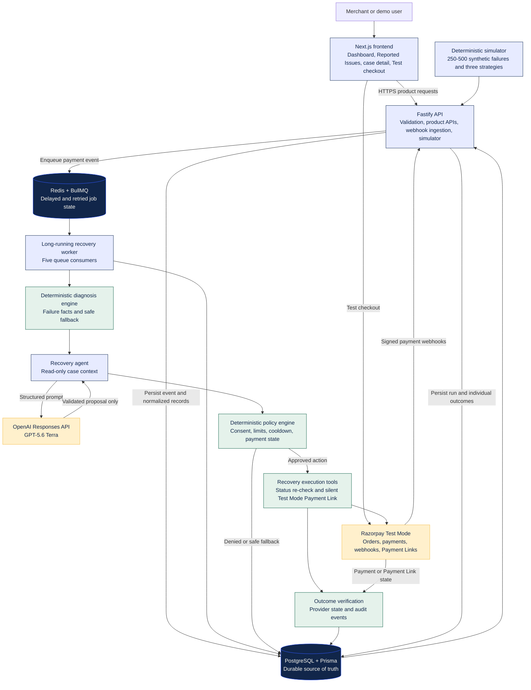
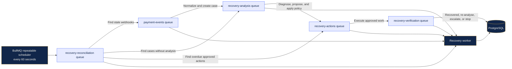

# RecoveryOS Architecture

RecoveryOS is an explainable recovery layer on top of Razorpay. It turns a failed payment into a durable case, diagnoses the likely cause, asks AI for one bounded recommendation, checks that recommendation against deterministic policy, schedules any approved work, and follows the payment until it is recovered, escalated, or stopped.

The model is advisory. It cannot call Razorpay, write to PostgreSQL, enqueue work, or contact a customer.

## System architecture

## Queue and scheduling architecture

Recovery work runs outside the API request so a webhook can be acknowledged quickly and delayed actions survive API restarts.

This is the project's cron-like behavior. There is no external cron service or dedicated VM. BullMQ stores the repeatable schedule in Redis and triggers reconciliation every 60 seconds while the continuously running worker is online.

## Hosting split

| Runtime         | Platform | Role                                               |
| --------------- | -------- | -------------------------------------------------- |
| Next.js web     | Vercel   | Dashboard, Reported Issues, checkout, and About    |
| Fastify API     | Railway  | Product APIs and Razorpay webhook ingestion        |
| Recovery worker | Railway  | Five BullMQ consumers and 60-second reconciliation |
| PostgreSQL      | Railway  | Durable source of truth                            |
| Redis           | Railway  | Queue, retry, and scheduler state                  |

Vercel cannot run the API or worker. Those processes must stay online so delayed jobs and webhook acknowledgements survive.

## Integrated components

| Component                     | Responsibility                                                                                                |
| ----------------------------- | ------------------------------------------------------------------------------------------------------------- |
| Next.js and React             | Merchant dashboard, Reported Issues, recovery detail, architecture explanation, and Test Mode checkout        |
| Fastify                       | Product APIs, analytics, simulator endpoint, secure headers, rate limits, and Razorpay webhook ingestion      |
| Razorpay Test Mode            | Checkout orders, failed-payment events, payment state checks, and silent Payment Links without live money     |
| OpenAI Responses API          | A structured `gpt-5.6-terra` recovery proposal from read-only case facts                                      |
| Deterministic recovery engine | Failure diagnosis, fallback action, and policy authority over every proposal                                  |
| PostgreSQL and Prisma         | Cases, customers, payments, actions, policies, webhook events, jobs, audits, simulation runs, and outcomes    |
| Redis and BullMQ              | Persistent queues, delayed work, bounded retries, stable job IDs, verification, and repeatable reconciliation |
| Recovery worker               | Consumes all five queues and connects diagnosis, AI, policy, tools, and verification                          |
| Simulator                     | Reproducible comparison of no intervention, naive retry, and RecoveryOS using labelled synthetic money        |

## Safety and reliability boundaries

- Razorpay webhook signatures are verified before events are accepted.
- Provider events, actions, and jobs use stable IDs and database constraints to prevent duplicate work.
- Payment state is re-checked immediately before an approved side effect.
- Razorpay 5xx responses are retried with the same action-bound reference, preventing duplicate Payment Links.
- AI output is Zod-validated and falls back to deterministic advice when unavailable or malformed.
- Policy can deny any AI proposal regardless of model confidence.
- Logs redact secrets, signatures, and payment identifiers.
- Every record and amount is labelled `SIMULATED` or `RAZORPAY_TEST_MODE`; neither represents live merchant revenue.
