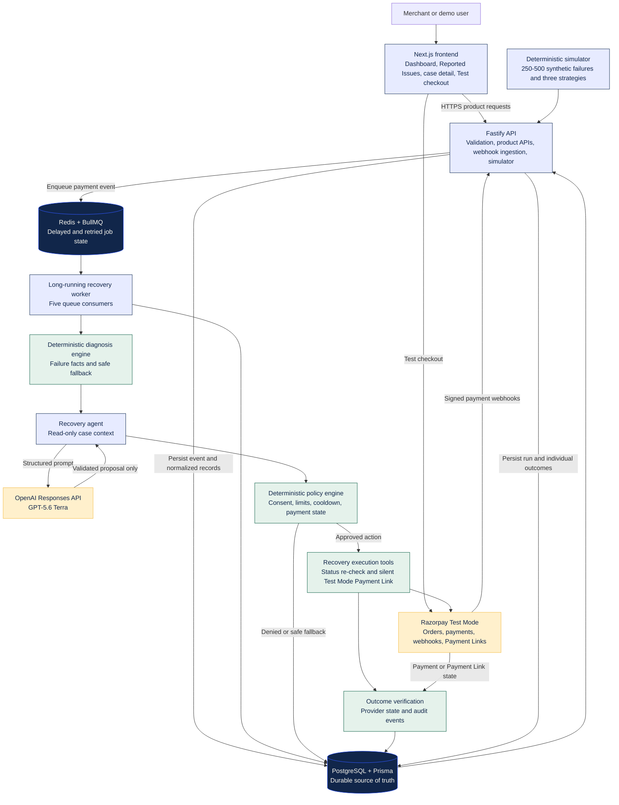
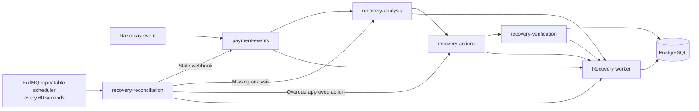

# RecoveryOS

RecoveryOS is an explainable revenue-recovery layer for Razorpay merchants. It turns a failed payment into a durable recovery case, diagnoses why it failed, asks OpenAI for one bounded recommendation, checks that recommendation against deterministic policy, executes only approved actions, and follows the payment to a verified outcome.

The central rule is simple:

> AI can propose. It cannot move money, contact customers, write to the database, or bypass merchant policy.

The project combines a merchant-facing recovery dashboard with Razorpay Test Mode, an OpenAI-powered proposal agent, deterministic safeguards, persistent BullMQ workflows, and an auditable simulator. Every record is visibly labelled `SIMULATED` or `RAZORPAY_TEST_MODE`; neither represents live merchant revenue.

> **Project status:** Steps 0–4, 6–8, and 10–11 are complete. Step 12's judge-ready demo package is in progress. Step 9 still needs one live paid Payment Link acceptance check, while Step 5's live webhook needs a public HTTPS URL and a separate signing secret. See [Project status](#project-status) and [`LIMITATIONS.md`](./LIMITATIONS.md).

## Why this project exists

Razorpay can tell a merchant that a payment failed. The harder operational question is what should happen next.

Depending on the evidence, RecoveryOS can recommend waiting, presenting another payment method, creating a Test Mode Payment Link, recording a simulated reminder, escalating for human review, or stopping recovery entirely. The recommendation is never trusted by itself: deterministic code checks payment state, customer consent, merchant limits, cooldowns, recovery windows, duplicate work, and failure type before anything is scheduled.

This gives a merchant three things that a blind retry does not:

- a reasoned decision for each failed payment;
- a controlled, idempotent recovery workflow; and
- a measurable, auditable view of what was recovered and why.

## What the demo includes

- An executive dashboard for revenue at risk, recovery rate, funnel stages, failure categories, strategies, and simulated incremental recovery.
- A filterable **Reported Issues** table backed by PostgreSQL rather than hardcoded frontend data.
- A recovery-case page showing normalized payment facts, diagnosis, proposed action, policy decision, execution state, and audit timeline.
- A Razorpay Test Mode checkout that can create successful or failed payments.
- Signed Razorpay webhook ingestion with raw-payload retention, normalized records, stable event IDs, and background processing.
- A GPT-5.6 Terra proposal agent with read-only context, strict structured output, bounded execution, and deterministic fallback.
- Five BullMQ queues for ingestion, analysis, action, verification, and reconciliation.
- A deterministic simulator comparing no intervention, naive retry, and RecoveryOS over 250–500 synthetic failed payments.
- Security and reliability controls including Helmet, API rate limits, log redaction, bounded retries, payment-state rechecks, and idempotent Payment Link references.
- A public `/about` page that explains the product and architecture without requiring repository knowledge.

## Recovery workflow

```text
Detect → Diagnose → Propose → Guard → Execute → Verify → Measure
```

1. Razorpay Test Mode sends a signed payment event, or the simulator creates a clearly labelled synthetic case.
2. The API verifies and persists the event before enqueueing background work.
3. Deterministic diagnosis classifies the failure and creates an explainable safe fallback.
4. GPT-5.6 Terra receives read-only case facts and returns one schema-validated proposal.
5. Deterministic policy approves, replaces, delays, escalates, or rejects the proposal.
6. BullMQ schedules approved work with stable job and action identifiers.
7. The worker rechecks current payment state immediately before any side effect.
8. Razorpay status or Payment Link results are verified and written to the audit timeline.
9. The dashboard and simulator report the resulting recovery outcome.

## Architecture at a glance



The complete system diagram, queue diagram, integration responsibilities, and reliability boundaries are documented in [`ARCHITECTURE.md`](./ARCHITECTURE.md).

### Integrated components

| Component              | Responsibility                                                                                              |
| ---------------------- | ----------------------------------------------------------------------------------------------------------- |
| Next.js and React      | Dashboard, Reported Issues, case detail, Test Mode checkout, and About page                                 |
| Fastify and TypeScript | Product APIs, analytics, simulator runs, secure webhook ingestion, health checks, and rate limiting         |
| Razorpay Test Mode     | Checkout orders, payment events, status checks, and silent Test Mode Payment Links                          |
| OpenAI Responses API   | One structured `gpt-5.6-terra` recovery proposal from read-only case facts                                  |
| Recovery engine        | Deterministic diagnosis, safe fallback, policy checks, and execution authorization                          |
| PostgreSQL and Prisma  | Durable cases, payments, customers, events, policies, actions, jobs, audits, and simulator outcomes         |
| Redis and BullMQ       | Persistent queues, delays, bounded retries, stable job IDs, verification, and scheduled reconciliation      |
| Recovery worker        | Connects all five queues to diagnosis, AI, policy, provider tools, and outcome verification                 |
| Simulator              | Reproducible strategy comparison using labelled synthetic payments and evaluator-only outcome probabilities |
| Zod                    | Runtime validation for configuration, HTTP boundaries, provider data, and AI output                         |

### Queue and scheduler model

The worker consumes these queues in sequence:

1. `payment-events`
2. `recovery-analysis`
3. `recovery-actions`
4. `recovery-verification`
5. `recovery-reconciliation`



Reconciliation is the project's cron-like behavior. A BullMQ repeatable scheduler stores the schedule in Redis and runs reconciliation every 60 seconds while the worker is online. It finds stale webhook events, cases missing analysis, and overdue approved actions, then safely places them back into the appropriate queue.

No external cron provider or dedicated VM is required, but the application does require a continuously running worker process. The worker can run locally or as a small persistent service on a deployment platform.

### Data ownership

- **PostgreSQL is the durable source of truth** for business and audit state.
- **Redis/BullMQ owns asynchronous job state**, delays, retries, and the repeatable schedule.
- **Razorpay owns payment truth**, which is rechecked before execution and during verification.
- **OpenAI owns no product state** and receives no execution, database-write, Razorpay, or messaging tools.

## Safety and reliability model

- Webhook signatures are verified before events are accepted.
- Raw provider payloads are retained for audit while merchant-facing APIs expose normalized fields.
- Provider events, actions, and jobs use stable IDs and database constraints to prevent duplicate work.
- Payment state is checked immediately before an approved recovery action.
- A Razorpay 5xx retry reuses the same action-bound Payment Link reference and first looks for an existing link.
- OpenAI output is Zod-validated; timeouts, provider errors, or malformed responses fall back to deterministic advice.
- Policy retains authority even when the model is confident.
- Recovery jobs use bounded retries and escalate when attempts are exhausted.
- Secrets, signatures, and payment identifiers are redacted from structured logs.
- Money is stored as integer paise, never floating-point rupees.
- Simulated records and Test Mode records are labelled throughout the API and UI.

## Product surfaces

| Route              | Purpose                                                           |
| ------------------ | ----------------------------------------------------------------- |
| `/`                | Executive recovery dashboard and simulator comparison             |
| `/recoveries`      | Searchable, filterable, and sortable Reported Issues table        |
| `/recoveries/[id]` | Case facts, recovery reasoning, actions, and audit timeline       |
| `/demo/checkout`   | Razorpay Test Mode checkout and failure generation                |
| `/about`           | Plain-language project, integration, and architecture explanation |

## Quick start

### Prerequisites

- Node.js `22.18.0`
- pnpm `10.33.0`
- Docker Desktop
- Optional for full integration: Razorpay Test Mode credentials and an OpenAI API key

### Install and run

```bash
cp .env.example .env
pnpm install --frozen-lockfile
pnpm infra:up
pnpm db:setup
pnpm dev
```

`pnpm db:setup` builds the required domain package, generates the Prisma client, applies migrations, and loads a deterministic Aurora Retail demo workspace. Re-running `pnpm db:seed` resets that demo merchant to the records generated from `DEMO_SEED`.

`pnpm dev` builds shared packages and starts the web, API, and worker applications together. To run one application while developing, use `pnpm dev:web`, `pnpm dev:api`, or `pnpm dev:worker`.

### Local services

| Service                | URL                                   |
| ---------------------- | ------------------------------------- |
| Web application        | `http://localhost:3000`               |
| Test Mode checkout     | `http://localhost:3000/demo/checkout` |
| About and architecture | `http://localhost:3000/about`         |
| API health             | `http://localhost:4000/health`        |
| Worker health          | `http://localhost:4001/health`        |
| PostgreSQL             | `localhost:5432`                      |
| Redis                  | `localhost:6380`                      |

Redis uses host port `6380` because a machine-level Redis instance may already occupy `6379`. The project container still uses Redis's standard internal port `6379`.

Stop Docker infrastructure without deleting persistent volumes:

```bash
pnpm infra:down
```

## Deploy

RecoveryOS is three runtimes plus two data stores. Only the Next.js app belongs on Vercel.

| Piece         | Where it runs | Why                                                                               |
| ------------- | ------------- | --------------------------------------------------------------------------------- |
| `apps/web`    | **Vercel**    | Serverless Next.js hosting                                                        |
| `apps/api`    | **Railway**   | Long-running Fastify process, including `POST /webhooks/razorpay`                 |
| `apps/worker` | **Railway**   | BullMQ must stay connected to Redis for delayed jobs and 60-second reconciliation |
| PostgreSQL    | **Railway**   | Durable source of truth                                                           |
| Redis         | **Railway**   | Queue, retry, and scheduler state                                                 |

Do not try to run the API or worker as Vercel serverless functions. They are persistent Node processes. Render can replace Railway if you prefer; the same split still applies.

Tonight you can publish the web app. Dashboard and Reported Issues will show the existing API-unavailable error until Railway is live. `/about` is static and will work immediately. Tomorrow: PostgreSQL, Redis, API, worker, then the Razorpay webhook URL.

### Tonight — Vercel web app

1. Push the current `main` branch to GitHub (`https://github.com/harshsinha-12/rzpy-agent`).
2. Open [Vercel](https://vercel.com), import that repository, and create a Next.js project.
3. Set **Root Directory** to `apps/web`. Leave **Include source files outside of the Root Directory** enabled.
4. Set **Node.js Version** to `22.x`.
5. Confirm these commands (also stored in `apps/web/vercel.json`):
   - Install: `cd ../.. && HUSKY=0 pnpm install --frozen-lockfile`
   - Build: `cd ../.. && pnpm --filter @recoveryos/domain build && pnpm --filter @recoveryos/web build`
6. Add these Vercel environment variables for Production. You can leave the API URLs pointing at localhost for tonight; change them after Railway is up.

| Variable                        | Tonight                                                     | After Railway                                                           |
| ------------------------------- | ----------------------------------------------------------- | ----------------------------------------------------------------------- |
| `APP_BASE_URL`                  | Optional. Vercel preview/production URLs are used if unset. | Your production Vercel URL, for example `https://recoveryos.vercel.app` |
| `API_BASE_URL`                  | `http://localhost:4000`                                     | Public Railway API URL, no trailing slash                               |
| `NEXT_PUBLIC_API_URL`           | `http://localhost:4000`                                     | Same Railway API URL                                                    |
| `NEXT_PUBLIC_WORKER_HEALTH_URL` | `http://localhost:4001`                                     | Public Railway worker URL                                               |

Do **not** put Razorpay secrets, the webhook secret, `DATABASE_URL`, `REDIS_URL`, or `OPENAI_API_KEY` on Vercel. Those belong on Railway.

7. Deploy. After it succeeds, open `/about`. `/` and `/recoveries` will say the API is unavailable until tomorrow. Copy the Vercel URL; the Railway API will need it as `APP_BASE_URL` for CORS.

### Tomorrow — Railway database, API, worker, webhook

Create one Railway project with four services: PostgreSQL, Redis, API, and worker.

**Postgres and Redis**

1. Add Railway **PostgreSQL** and **Redis** plugins. Copy `DATABASE_URL` and `REDIS_URL` from Railway. If the Postgres URL has no SSL query string, append `?sslmode=require`.
2. From your laptop, against the remote database (never commit the URL):

```bash
export DATABASE_URL="postgresql://..."
pnpm db:setup
```

That generates the Prisma client, applies migrations, and loads the deterministic demo seed.

**API service**

1. New Railway service from the same GitHub repo.
2. Set the builder to **Dockerfile** with path `deploy/Dockerfile.api` and context `/`.
3. Health check path: `/health`.
4. Variables:

| Variable                        | Value                                         |
| ------------------------------- | --------------------------------------------- |
| `NODE_ENV`                      | `production`                                  |
| `APP_BASE_URL`                  | The Vercel URL from tonight                   |
| `DATABASE_URL`                  | Railway Postgres URL                          |
| `REDIS_URL`                     | Railway Redis URL                             |
| `RAZORPAY_TEST_MODE_API_KEY`    | Test Mode Key ID                              |
| `RAZORPAY_TEST_MODE_SECRET_KEY` | Test Mode Key Secret                          |
| `RAZORPAY_WEBHOOK_SECRET`       | Leave empty until the Razorpay webhook exists |
| `API_HOST`                      | `0.0.0.0`                                     |

Do not set `API_PORT`. Railway injects `PORT`, and the API listens on it.

**Worker service**

1. Second Railway service, Dockerfile path `deploy/Dockerfile.worker`, context `/`.
2. Health check path: `/health`.
3. Variables:

| Variable                        | Value                     |
| ------------------------------- | ------------------------- |
| `NODE_ENV`                      | `production`              |
| `DATABASE_URL`                  | Same Postgres URL         |
| `REDIS_URL`                     | Same Redis URL            |
| `OPENAI_API_KEY`                | OpenAI key                |
| `OPENAI_MODEL`                  | `gpt-5.6-terra`           |
| `RAZORPAY_TEST_MODE_API_KEY`    | Same Test Mode Key ID     |
| `RAZORPAY_TEST_MODE_SECRET_KEY` | Same Test Mode Key Secret |
| `WORKER_HEALTH_HOST`            | `0.0.0.0`                 |

Do not set `WORKER_HEALTH_PORT`. The worker health server also uses Railway's `PORT`.

Generate public HTTPS domains for both Railway services. Confirm:

```bash
curl https://<api-host>/health
curl https://<worker-host>/health
```

Then update the three Vercel API/worker URLs and redeploy the web app.

**Razorpay webhook**

1. In Razorpay Dashboard → Webhooks, create a Test Mode webhook for `https://<api-host>/webhooks/razorpay`.
2. Subscribe to `payment.failed`, `payment.authorized`, `payment.captured`, and `payment_link.paid`.
3. Store the webhook's signing secret as `RAZORPAY_WEBHOOK_SECRET` on the Railway API service only. Redeploy or restart the API.
4. Pay with UPI ID `failure@razorpay` on the deployed `/demo/checkout`, then filter Reported Issues by `RAZORPAY_TEST_MODE`.

## Environment configuration

Copy [`.env.example`](./.env.example) to an untracked `.env` file. Never place credential values in documentation, screenshots, chat, fixtures, or source control.

| Variable                        | Purpose                                     | Requirement                            |
| ------------------------------- | ------------------------------------------- | -------------------------------------- |
| `DATABASE_URL`                  | Prisma connection to PostgreSQL             | Required                               |
| `REDIS_URL`                     | BullMQ and worker connection to Redis       | Required                               |
| `NEXT_PUBLIC_API_URL`           | Browser-visible Fastify base URL            | Required by web                        |
| `NEXT_PUBLIC_WORKER_HEALTH_URL` | Browser-visible worker health URL           | Required by web health link            |
| `RAZORPAY_TEST_MODE_API_KEY`    | Razorpay Test Mode Key ID                   | Required for Test Mode checkout/tools  |
| `RAZORPAY_TEST_MODE_SECRET_KEY` | Razorpay Test Mode Key Secret               | Required for Test Mode checkout/tools  |
| `RAZORPAY_WEBHOOK_SECRET`       | Separate Razorpay webhook signing secret    | Required only for signed live delivery |
| `OPENAI_API_KEY`                | OpenAI Responses API authentication         | Required for live AI proposals         |
| `OPENAI_MODEL`                  | Proposal model; defaults to `gpt-5.6-terra` | Optional override                      |
| `DEMO_SEED`                     | Reproducible database seed                  | Optional                               |
| `DEFAULT_DATA_SOURCE`           | Default record label, normally `SIMULATED`  | Optional                               |

The credential names above are intentional. Legacy `RAZORPAY_KEY_ID` and `RAZORPAY_KEY_SECRET` variables are not used.

## Demo walkthrough

### Seeded product flow

1. Start the infrastructure and applications.
2. Open `/` and review revenue at risk, funnel stages, failure categories, and strategy performance.
3. Open `/recoveries` to inspect the Reported Issues table and filter by source or recovery state.
4. Open a case to review evidence, diagnosis, model proposal, policy decision, actions, and audit history.
5. Run the deterministic simulator and compare no intervention, naive retry, and RecoveryOS.
6. Open `/about` for the judge-friendly product and architecture explanation.

### Razorpay Test Mode flow

1. Create Test Mode API keys in the Razorpay dashboard.
2. Add `RAZORPAY_TEST_MODE_API_KEY` and `RAZORPAY_TEST_MODE_SECRET_KEY` to `.env`.
3. Restart the API and worker so they load the configuration.
4. Open `/demo/checkout` and pay with Razorpay's failure UPI ID `failure@razorpay`.
5. Filter Reported Issues by `RAZORPAY_TEST_MODE`.
6. For real webhook delivery, expose `POST /webhooks/razorpay` over public HTTPS, subscribe to `payment.failed`, `payment.authorized`, `payment.captured`, and `payment_link.paid`, then configure its separate signing secret as `RAZORPAY_WEBHOOK_SECRET`.

Payment Links created by RecoveryOS are silent Test Mode links: provider notifications and reminders are disabled. Reminder and alternative-method actions are recorded as simulated rather than contacting a customer.

## API reference

### Product and analytics

| Endpoint                  | Purpose                                                                      |
| ------------------------- | ---------------------------------------------------------------------------- |
| `GET /recovery/cases`     | Paginated Reported Issues with search, filters, and sorting                  |
| `GET /recovery/cases/:id` | Payment facts, customer context, actions, reasoning, and audit history       |
| `GET /analytics/overview` | Reconciled KPIs, funnel, breakdowns, strategy results, and latest simulation |
| `POST /simulator/run`     | Run and persist a deterministic strategy evaluation                          |

The case list accepts `page`, `pageSize`, `search`, `status`, `failureCategory`, `paymentMethod`, `dataSource`, `errorSource`, `sortBy`, and `sortOrder`. Supported sorting includes `amountAtRiskPaise` and `lastUpdatedAt`. Invalid input uses a consistent error envelope.

### Razorpay Test Mode

| Endpoint                      | Purpose                                                         |
| ----------------------------- | --------------------------------------------------------------- |
| `POST /webhooks/razorpay`     | Verify, persist, normalize, and enqueue a signed Razorpay event |
| `GET /demo/razorpay/checkout` | Report whether Test Mode checkout is configured                 |
| `POST /demo/razorpay/orders`  | Create a Razorpay Test Mode order                               |

## AI and deterministic policy

The recovery agent uses the OpenAI Responses API with `gpt-5.6-terra` by default. It receives a read-only case context and returns a single structured proposal. The request is bounded to low reasoning effort, 700 maximum output tokens, a 12-second timeout, one SDK retry, and `store: false`.

The agent has no Razorpay, database-write, queue, or messaging tools. Its output is independently checked for:

- current payment state;
- allowed action and message limits;
- recovery window and cooldown;
- customer contact consent;
- merchant-side failures;
- already approved or duplicate work; and
- action-specific safety requirements.

If the API is unavailable or the output is invalid, RecoveryOS uses the deterministic diagnosis fallback and applies the same policy checks.

## Simulator and evaluation

The simulator generates 250–500 failed payments and evaluates three strategies over the same deterministic outcome roll:

- no intervention;
- naive immediate retry; and
- RecoveryOS.

Hidden recovery probabilities belong only to the evaluator; strategy code sees ordinary payment facts and cannot infer the generated outcome. Each payment-and-strategy result is stored so aggregate metrics remain auditable. Repeating the same seed and payment count reproduces the same inputs and results.

```bash
curl -X POST http://localhost:4000/simulator/run \
  -H 'content-type: application/json' \
  -d '{"seed":20260821,"paymentCount":500}'
```

The dashboard displays recovered revenue, incremental recovery, recovery rate, attempts, policy stops, false interventions, and customer-contact counts. All values from this harness are explicitly marked `SIMULATED`.

## Repository structure

RecoveryOS is a pnpm monorepo organized by deployable application and reusable domain boundary.

```text
apps/
  web/       Next.js merchant experience
  api/       Fastify product API and webhook boundary
  worker/    Long-running BullMQ consumers and health server

deploy/
  Dockerfile.api     Railway image for the Fastify API
  Dockerfile.worker  Railway image for the recovery worker

packages/
  agents/           OpenAI proposal agent, prompt, schemas, and read-only tools
  config/           Shared TypeScript and build configuration
  database/         Prisma client, schema, migrations, and deterministic seed
  domain/           Shared contracts, queue names, constants, and redaction
  razorpay/         Test Mode client, schemas, webhook verification, and mapping
  recovery-engine/  Pure diagnosis, policy, idempotency, and execution contracts
  simulator/        Synthetic generator, hidden outcome model, strategies, evaluator
```

The code follows feature-first modules and keeps transport, services, persistence, integrations, and presentation separate. AI orchestration lives in `agent.ts`; its narrow read-only adapters live in `tools.ts`. Frontend fetchers, schemas, types, and transformations remain separate from rendering components.

See [`PROJECT_STRUCTURE.md`](./PROJECT_STRUCTURE.md) for the complete tree, dependency direction, configuration rules, agent file contract, and conventions for globals, utilities, fetchers, and tests.

## Validation and development workflow

Run the complete local verification suite:

```bash
pnpm format:check
pnpm lint
pnpm typecheck
pnpm test
pnpm test:e2e
pnpm build
pnpm db:setup
```

- The root test command runs workspaces serially because API, worker, and integration tests intentionally share and reseed the local demo database.
- `pnpm test:e2e` exercises the primary recovery path, including a retryable Razorpay failure and duplicate-link protection.
- The web production build uses Next.js Webpack mode because Turbopack's CSS helper may require a temporary local port in restricted build environments.
- `pnpm install` prepares Husky. The pre-commit hook uses lint-staged to run ESLint and Prettier against staged files only.

## Project documents

| Document                                         | Use it for                                                                                           |
| ------------------------------------------------ | ---------------------------------------------------------------------------------------------------- |
| [`idea.md`](./IDEA.md)                           | Original product concept, personas, workflow, and hackathon framing                                  |
| [`ARCHITECTURE.md`](./ARCHITECTURE.md)           | Complete system and queue diagrams, integrations, and runtime boundaries                             |
| [`PROJECT_STRUCTURE.md`](./PROJECT_STRUCTURE.md) | Folder conventions, dependency direction, modularity, agents, utilities, configuration, and fetchers |
| [`PLAN.md`](./PLAN.md)                           | Ordered implementation steps, deliverables, and acceptance gates                                     |
| [`STATUS.md`](./STATUS.md)                       | Current step, credential state, blockers, validation evidence, and session history                   |
| [`DECISIONS.md`](./DECISIONS.md)                 | Durable product and architecture decisions with rationale                                            |
| [`LIMITATIONS.md`](./LIMITATIONS.md)             | Intentional demo, reliability, security, and operational constraints                                 |
| [`AGENTS.md`](./AGENTS.md)                       | Working agreement for coding agents and step-gated delivery rules                                    |
| [`.env.example`](./.env.example)                 | Safe configuration contract without credential values                                                |

## Project status

The repository follows the acceptance-gated sequence in [`PLAN.md`](./PLAN.md), while [`STATUS.md`](./STATUS.md) records the exact current state and append-only session evidence.

At present:

- the dashboard, Reported Issues, case detail, Razorpay ingestion path, diagnosis, AI proposal, policy engine, queues, execution tools, simulator, reliability controls, About page, and architecture documentation are implemented;
- Razorpay Test Mode API credentials and the OpenAI key are configured locally;
- a public signed webhook endpoint still needs deployment configuration and `RAZORPAY_WEBHOOK_SECRET`;
- one Payment Link still needs to be paid in Test Mode to complete the live Step 9 acceptance gate; and
- reminders and alternative-method outreach remain simulated and never send real customer messages.

Known constraints are documented rather than hidden. Read [`LIMITATIONS.md`](./LIMITATIONS.md) before presenting the project as production-ready.
